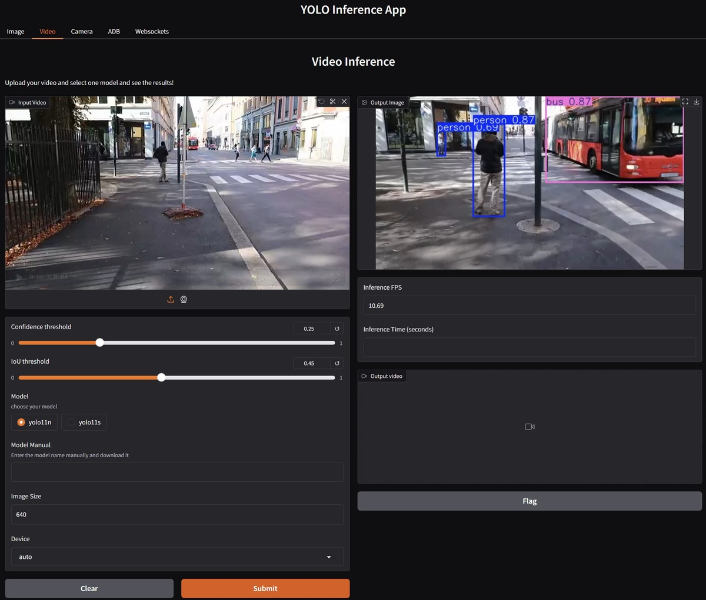

# YOLO Gradio

This simple web application based on gradio uses YOLO (You Only Look Once) to detect objects in images. The app provides a simple interface to launch the YOLO model against different sources: images, videos, etc.



## Inference types

The app supports the following inference types:

- Image: Detect objects in a single image.
- Video: Detect objects in a video.
- Camera: Detect objects in real-time using your camera. Tested on RTSP cameras.
- ADB: Detect objects in a video stream from an Android device.
- Websocket: Detect objects in a video stream from a web socket. Currently, it only supports H.264 encoded video. It should be adjusted to work with the desired video format and WS server. In this example, a reworked `py-scrcpy-server` is used to send the video stream to the WebSocket server.

## Installation

To install the app, you can use the following command:

For CPU/MPS:

```bash
pip install -r requirements.txt
```

or

```bash
poetry install
```

For GPU:

```bash
pip install -r requirements-gpu.txt
```

To be able to use WebSockets inference, you need to install the `ws` extras:

```bash
poetry install --extras ws
```

or install manually:

```bash
pip install av
```

## Usage

There are the following options you can change in the graphical interface:
- Confidence threshold: The minimum confidence level for the detected objects.
- IoU threshold: The minimum Intersection over Union (IoU) for the detected objects.
- Model: The YOLO model is to be used. The default model is `yolo11n` and will be downloaded automatically if unavailable in the models folder.
- Model Manual: The name of the model to use. It's a fast way to download a model by name. The model name should be the same as the one on the Ultralytics repository.
- Image Size: The size of the image to use. The default size is 640. The smaller the size, the faster the inference.
- Device: The device to use for inference. The default device is `auto`. Possible values are `auto`, `cpu`, `cuda`, `mps`. Auto will use the GPU if available; otherwise, it will try to use MPS, and finally, it will use the CPU.

## Known Issues

- One can`t stop the video stream by clicking on the stop button. You need to stop the app. That is valid for the following inference types: Camera, ADB, Websocket.
- It saves output videos with bounding boxes but doesn't show them in the app.